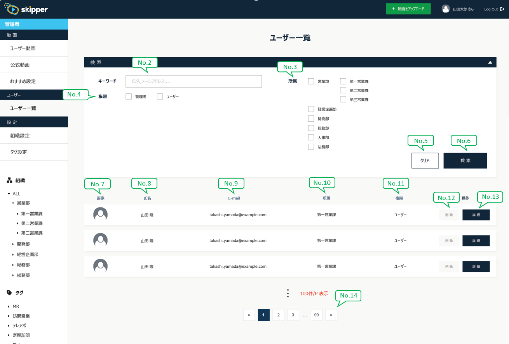

# S201-1_ユーザー検索

## Screen's image

## Screen access privileges
※Tham chiếu file [画面一覧] trên Google Drive

## Basic information
### Item list
| No. | Name | View | Type | Required | Max Chara | Validation | Default | API1(Param) | API1(Res) | API2(Res) |
| --- | ---- | ---- | ---- | -------- | --------- | ---------- | ------- | ---------- | ---------- | ---------- |
| - | Phần điều kiện search | - | - | - | - | - | - | - | - | - |
| 1 | 新しいユーザーを追加 | Y | button | - | - | - | - | - | - | - |
| 2 | 氏名 | - | text | - | - | - | - | name | - | - |
| 2-1 | E-mail | - | text | - | - | - | - | email | - | - |
| 3 | 所属 | - | check | - | - | - | - | organizationId | - | name, lowOrganization.name |
| 4 | 権限 | - | check | - | - | 1: 管理者 2: ユーザー | - | authority | - | - |
| 5 | クリア | Y | button | - | - | - | - | - | - | - |
| 6 | 検索 | Y | button | - | - | - | - | - | - | - |
| 6-2 | CSVをエクスポート | Y | button | - | - | - | - | - | - | - |
| - | Dưới đây là phần data record | - | - | - | - | - | - | - | - | - |
| 6-1 | 該当件数 | Y | text | - | - | - | - | - | ※Tham khảo [Phân trang] trong file common | - |
| 7 | 画像 | Y | image | - | - | - | - | - | imagePath | - |
| 8 | 氏名 | Y | text | - | - | - | - | - | name | - |
| 9 | E-mail | Y | text | - | - | - | - | - | email | - |
| 10 | 所属 | Y | text | - | - | - | - | - | organization.name | - |
| 11 | 権限 | Y | text | - | - | - | - | - | authority | - |
| 12 | 削除 | Y | button | - | - | - | - | - | - | - |
| 13 | 詳細 | Y | button | - | - | - | - | - | - | - |
| 14 | Pagination | Y | button | - | - | - | - | - | - | - |

## In-screen item / Processing privileges control

| No. | Name | privileges | Content |
| --- | ---- | ---- | ---- |
| 6-2 | CSVをエクスポート | 0 (システム管理者) | Không hiển thị với quyền hạn 1 (組織管理者), 2 (一般ユーザー) |

## Trigger processing content

| No. | Name | Action | Content |
| --- | ---- | ------ | ------- |
| 1 | 新しいユーザーを追加 | Khi nhấn | Chuyển đến màn hình [S201-3_ユーザー登録]　|
| 3 | 所属 | Khi khởi động | Trường hợp nhiều tầng, layout của hạng mục này vượt quá vùng điều kiện search, thì hiển thị scroll ngang cho vùng điều kiện search, hiển thị toàn bộ các tầng　|
| 5 | クリア | Khi nhấn | ※Tham chiếu mục [Nút [クリア] (Clear)] trong file [common.md]　|
| 12 | 削除 | Khi nhấn | ※Tham chiếu mục [Nút [削除] (Delete)] trong file [common.md] →Về parameter của message thì set {1} = ユーザー 　※Có chỉ định cử động sau khi xóa　|
| 13 | 詳細 | Khi nhấn | Chuyển đến màn hình [S201-2_ユーザー表示]　|
| - | Vùng điều kiện searhc | Khi nhấn (Khi vùng điều kiện search ở trạng thái mở) | Đóng vùng điều kiện search　|
|  |  | Khi nhấn (Khi vùng điều kiện search ở trạng thái đóng) | Mở vùng điều kiện search　|

## Use API
| No. | Name | Action | API name | Param | Content |
| --- | ---- | ------ | -------- | ----- | ------- |
| - | - | 起動時 | userSearch | - | ・Chạy API [userSearch (API1)] Trường hợp failure 　Dừng lại ở màn hình này, hiển thị message API trả về Trường hợp success 　Phản ánh giá trị trả về vào các hạng mục trên màn hình 　※Tham chiếu phần [Basic information] bên trên |
| - | - | 起動時 | organizationSearch | - | ・Chạy API [organizationSearch (API2)] Trường hợp failure 　Dừng lại ở màn hình này, hiển thị message API trả về Trường hợp success 　Phản ánh giá trị trả về vào các hạng mục trên màn hình 　※Tham chiếu phần [Basic information] bên trên |
| 6 | 検索 | Khi nhấn | userSearch | ※Tham chiếu phần [Basic information] bên trên | ・Chạy API [userSearch (API1)] Trường hợp failure 　Dừng lại ở màn hình này, hiển thị message API trả về Trường hợp success 　Phản ánh giá trị trả về vào các hạng mục trên màn hình 　※Tham chiếu phần [Basic information] bên trên |
| 6-2 | CSVをエクスポート | Khi nhấn | userSearch | ※Tham chiếu phần [Basic information] bên trên | ・Chạy API [userSearch (API1)] Trường hợp failure 　Dừng lại ở màn hình này, hiển thị message API trả về Trường hợp success 　Xuất response thành CSV 　※Chi tiết xuất CSV tham chiếu file [R102 user_CSV]　|
| 12 | 削除 | Khi nhấn | userDelete | [id] = user.id của user bị nhấn nút | ・Chạy API [userDelete (API3)] Trường hợp failure 　Dừng lại ở màn hình này, hiển thị message API trả về Trường hợp success ・ Nếu user.id của user bị nhấn nút = [login.Response.id] Sau khi nhấn nút [削除] trên POPUP, hiển thị modal có message [ec-00085] và button [OK] ※Thiết kế của modal thì tham chiếu file [common.md] 　→ Sau khi nhấn [OK], chuyển đến màn hình [S100-1_ログイン] ・Nếu user.id của user bị nhấn nút != [login.Response.id] 　Reload màn hình |
| 14 | Pagination | Khi nhấn | userSearch | - | ・Chạy API [userSearch (API1)] Trường hợp failure 　Dừng lại ở màn hình này, hiển thị message API trả về Trường hợp success 　Phản ánh giá trị trả về vào các hạng mục trên màn hình 　※Tham chiếu phần [Basic information] bên trên |

### userSearch (API1)
| No. | Name | Content |
| --- | -- | --- |
| 7 | 画像 | ※Tham chiếu mục [Hình user, hình người đăng] trong file [common.md] |

### organizationSearch (API2)
Nothing

### userDelete (API3)
Nothing
